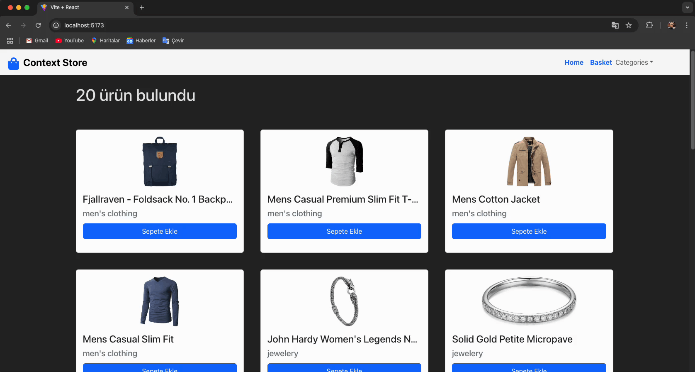

<h1>🛍 Context Store</h1>

Bu proje, React Context API kullanarak geliştirilen bir e-ticaret web sitesi örneğidir. 🚀 Sayfalar arası veri yönetimini Context yapısı ile sağlayarak, React ekosisteminde global state yönetimi konusundaki deneyimimi geliştirmeyi hedefledim.

<h2>📌 Proje Özellikleri</h2>

-📡 Gerçek API Kullanımı – Rapid API üzerinden ürün verilerini çektim.

-⚡ Context API – Sayfalar arası veri yönetimini Context ile sağladım.

-🔄 Ürün Sepet İşlemleri – Ürün ekleme, silme, adet artırma/azaltma ve toplam tutar hesaplama.

-🎨 Dinamik Ürün Kartları – API’den gelen verileri card bileşenleri ile ekrana listeleme.

-📁 Kategori Bazlı Filtreleme – Ürünleri dinamik olarak kategorize ettim.

-🌍 React Router DOM – Çoklu sayfa yapısını oluşturup, dinamik geçişler sağladım.

-🎭 Toastify Bildirimleri – Kullanıcı işlemlerine özel uyarılar ekledim.

-🎨 Bootstrap ile Hızlı Arayüz Tasarımı – Modern ve responsive bir tasarım oluşturuldu.

<h2>🛠 Kullanılan Teknolojiler</h2>

-⚛ React – Component yapıları ve state yönetimi için

-🌍 React Router DOM – Sayfa yönlendirmeleri için

-📡 Axios – API isteklerini yönetmek için

-🎨 Bootstrap – Hızlı ve responsive tasarım için

-🔥 Toastify – Kullanıcı bildirimleri için

-⚙ Context API – Global state yönetimi için

<h6>🎯 Deneyimler</h6>

🧠 Bu proje sayesinde React Context API’yi detaylıca öğrenme ve uygulama fırsatı buldum. State yönetimi, sayfalar arası veri paylaşımı, dinamik içerik render etme, API ile veri çekme ve komponent bazlı düşünme konularında önemli tecrübeler kazandım.

<h1>🎬 Ekran Görüntüsü</h1>

